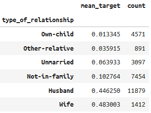
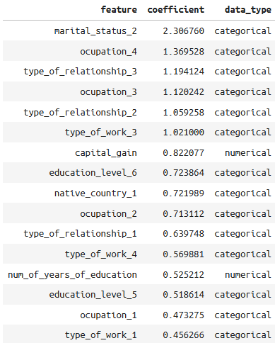
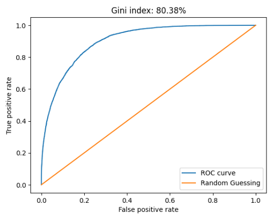
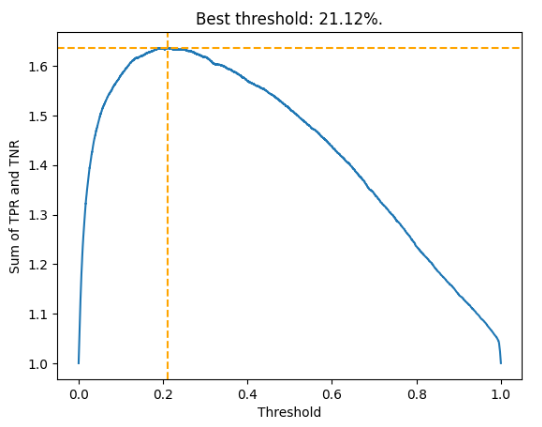

# Classifying Customers by Earnings

Luis Escárcega

---

# Introduction

- We have a dataset containing information about several customers.

- Numerical:
    - Age of client, final weight, number of years of education, capital gain, capital loss and hours of work per week.

- Categorical:
    - Type of work, education level, marital status, ocupation, type of relationship, type of race, sex and native country.

---

- For this problem we will assume that we are interested in those individuals who earn more than $50k (e.g., to offer them loans). We will refer to these as the positive class. The remainder we will refer to as the negative class.

- We will try to find a model that gives us scores that separate as much as possible the positive class from the negative class.

- Throughout the problem we will assume that the records come from a random sample, i.e., they are independent and identically distributed.

---

# Train and test split

- Before starting to explore the database, it is necessary to split the data into training and test sets. 

- In this problem we will not use a validation (also known as development) set, which is necessary to obtain unbiased estimates of the performance of various models. Instead, we will use cross-validation.

    - Number of individuals in the training set: 29304
    - Number of individuals in the test set: 3257

---

# Exploratory Data Analysis

- In this section we show some summaries regarding the variables we took from the customers and their relationship with the target variable.

- We present:

    - The number of categories 
    - The Herfindahl-Hirschman index, which measures how "diverse" the categorical variable is. Values close to zero indicate that the distribution of the training sample in each of the categories is approximately uniform, while values close to one indicate that a single category encompasses a large part of the sample.

---

- Also:

    - The Gini index of the variables, as well as 99% bootstrap confidence intervals. This metric takes values in [-1, 1]. Absolute values close to 1 indicate that the variable has a lot of predictive power, while values around zero indicate null predictive power.

---

Summary of type of work:

- Number of categories: 9
- Most common category: Private
- Highest proportion of positives: Self-emp-inc
- Lowest proportion of positives: Never-worked
- Herfindahl–Hirschman index: 44.07%
- Gini index: 16.62%
- Gini index confidence interval: (14.97%, 18.33%)

---

Summary of type of work:

---

Summary of education level:
- Number of categories: 16
- Most common category: HS-grad
- Highest proportion of positives: Doctorate
- Lowest proportion of positives: Preschool
- Herfindahl–Hirschman index: 13.68%
- Gini index: 43.33%
- Gini index confidence interval: (41.63%, 45.14%)
---

Summary of education level:

---

Summary of marital status:

- Number of categories: 7
- Most common category: Married-civ-spouse
- Highest proportion of positives: Married-civ-spouse
- Lowest proportion of positives: Never-married
- Herfindahl–Hirschman index: 23.03%
- Gini index: 53.91%
- Gini index confidence interval: (52.56%, 55.28%)
---

Summary of marital status:

---

Summary of ocupation:

- Number of categories: 15
- Most common category: Prof-specialty
- Highest proportion of positives: Exec-managerial
- Lowest proportion of positives: Priv-house-serv
- Herfindahl–Hirschman index: 3.25%
- Gini index: 46.09%
- Gini index confidence interval: (44.43%, 47.74%)
---

Summary of ocupation:

--- 

Summary of type of relationship:

- Number of categories: 6
- Most common category: Husband
- Highest proportion of positives: Wife
- Lowest proportion of positives: Own-child
- Herfindahl–Hirschman index: 12.13%
- Gini index: 55.92%
- Gini index confidence interval: (54.58%, 57.24%)

--- 

Summary of type of relationship:

---

Summary of type of race:

- Number of categories: 5
- Most common category: White
- Highest proportion of positives: Asian-Pac-Islander
- Lowest proportion of positives: Other
- Herfindahl–Hirschman index: 67.47%
- Gini index: 7.44%
- Gini index confidence interval: (6.42%, 8.60%)

---

Summary of type of race:

---

Summary of sex:

- Number of categories: 3
- Most common category: Male
- Highest proportion of positives: ?
- Lowest proportion of positives: Female
- Herfindahl–Hirschman index: 33.38%
- Gini index: 23.65%
- Gini index confidence interval: (22.40%, 24.88%)

---

Summary of sex:

--- 

Summary of native country:

- Number of categories: 42
- Most common category: United-States
- Highest proportion of positives: France
- Lowest proportion of positives: Outlying-US(Guam-USVI-etc)
- Herfindahl–Hirschman index: 79.78%
- Gini index: 6.03%
- Gini index confidence interval: (5.05%, 7.12%)

--- 

Summary of native country:

---

---

---

#### Remark:

- We can see that the most diverse categorical variable is, according to the HH index, “occupation” followed by “type_of_relationship”. The least diverse is “native_country” followed by “type_of_race”.

- Note that the most predominant native nationality and race are respectively United States and white. Therefore, it is not to be expected that any model fitted on this training set would have good predictions in populations where the majority native nationality is not the United States or where the predominant race is not white.

---

- From the confidence intervals we can see that all categorical variables have predictive power (since they do not contain zero), although not all are equally powerful. The most powerful is “type_of_relationship”, while the least powerful is “native_country”.

- Note that all levels corresponding to an elementary school level of education have about the same odds of individuals having an income above $50k, of about 5%. Therefore, categories such as “1st-4th”, “5th-6th”,..., “12th” can be joined. This will be done below in an automatic way.

--- 

Summary of age of client:

- Mean: 38.55
- Median: 37.00
- Standard Deviation: 13.65
- Range: 73.00
- Skewness: 0.56
- Kurtosis: -0.17
- Gini index: 36.94%
- Gini index confidence interval: (35.24%, 38.52%)

--- 

Summary of age of client:

--- 

Summary of final weight:

- Mean: 189909.67
- Median: 178469.50
- Standard Deviation: 105655.82
- Range: 1472420.00
- Skewness: 1.47
- Kurtosis: 6.50
- Gini index: -1.07%
- Gini index confidence interval: (-3.06%, 1.09%)

--- 

Summary of final weight:

---

Summary of number of years of education:

- Mean: 10.09
- Median: 10.00
- Standard Deviation: 2.57
- Range: 15.00
- Skewness: -0.31
- Kurtosis: 0.63
- Gini index: 43.27%
- Gini index confidence interval: (41.55%, 45.09%)

---

Summary of number of years of education:

---

Summary of capital gain:

- Mean: 1071.23
- Median: 0.00
- Standard Deviation: 7363.07
- Range: 99999.00
- Skewness: 11.98
- Kurtosis: 155.52
- Gini index: 17.90%
- Gini index confidence interval: (16.56%, 19.13%)

---

Summary of capital gain:

---

Summary of capital loss:

- Mean: 86.73
- Median: 0.00
- Standard Deviation: 401.25
- Range: 4356.00
- Skewness: 4.62
- Kurtosis: 20.70
- Gini index: 6.80%
- Gini index confidence interval: (5.88%, 7.71%)

---

Summary of capital loss:

---

Summary of hours of work per week:

- Mean: 40.46
- Median: 40.00
- Standard Deviation: 12.39
- Range: 98.00
- Skewness: 0.24
- Kurtosis: 2.92
- Gini index: 34.35%
- Gini index confidence interval: (32.51%, 35.84%)

---

Summary of hours of work per week:

---

### Remarks:

- We see that all numerical variables have predictive power, because their gini is statistically different from zero, except for “final weight” whose confidence interval contains zero.

- Some distributions are highly skewed to the right, for example, capital gain and capital loss.

---

# Preprocessing

In this part, we are going to make some treatments to the training base. Specifically: 

- We will reduce the number of levels per categorical variable.
    - As described above, in some variables we can see categories that have approximately the same proportion of positives. There are some statistical tests that can be used to determine whether there is evidence that the proportions at two different levels are equal. We will be using tests based on Agresti-Coull 99% confidence intervals. If it cannot be rejected that the proportions are different, the categories are merged.
    - This is done iteratively until there are no levels left that can be joined, i.e., all confidence intervals are disjoint.

---

- It is evident from the histograms that some numerical variables show outliers. We will eliminate the observations below the 0.05% percentile and above the 99.95% percentile. There are other techniques to do this, but we prefer this one for its simplicity.
- Since the variable final weight has a Gini index statistically equal to zero, we will eliminate this variable.
- We use one hot encoding to transform the categorical variables, including the target.
- Finally, the numerical predictors are standardized to have zero mean and unit standard deviation.

---

Merged levels for type of work:

---

Merged levels for education level:

---

Merged levels for marital status:

---

Merged levels for ocupation:

---

Merged levels for type of relationship:

---

Merged levels for type of race:

---

Merged levels for sex:

---

Merged levels for native country:

---

# Possible models

- For this type of customer classification problem there are a large number of model options, some more complex than others. For example:

1. Logistic Regression:
    - This is a classic statistical model. It is based on the idea that the probability of belonging to the positive class depends only on a linear combination of predictors.
    - Pros: Simple to understand and study
    - Cons: Tends to be suboptimal.

---

2. Neural Networks
    - It is a generalization of logistic regression and is based on the idea of iteratively constructing new predictors through linear combinations and activation functions.
    - Pros: It is a flexible model that adapts to any type of problem.
    - Cons: It tends to be over-parameterized, causing over-fitting. Can be complicated to put into production.

---

3. Decision Trees
    -  It is based on the idea of building optimal customer segments. The prediction of a customer can be obtained iteratively, being at each step the verification or not of a condition.
    - Pros: They are easy to understand, adjust and implement.
    - Cons: Tends to tend to have a lot of variance. Also, decision boundaries are complex. 

---

4. Gradient Boosting Decision Trees
    - It is a generalization of decision trees. It is based on iteratively adjusting several decision trees, where each one learns from the mistakes of the previous one.
    - Pros: It is perhaps the best model for tabular data (as in our case). It has proven to be superior to other more complex neural network models. It is easy to fit.
    - Cons: It is complex and can be difficult to put into production. 

---

5. Support vector machine
    - This model, like logistic regression, is linear in the sense that predictions are based only on a linear combination of predictors. 
    - Pros: It is a simple model, since it has a linear decision boundary.
    - Cons: It is not a probabilistic model. It only gives binary predictions.

---

- For this problem we will choose the Logistic Regression model because it is one of the simplest, most studied and easy to implement models. Moreover, being a probabilistic model, it can not only provide binary predictions, but also the likelihood of falling into a certain class.

---

# Model hypotheses

For the development of this Logistic Regression model we assume several things:

- There are no more outliers in the training base. Being a linear model, it is sensitive to these.
- The categories observed in the training base are all the possible ones. 
- In the bases where this model is used to make predictions, there are no null values (except for the categorical classes, where nulls are reported with “?”).
- Positive and negative clients are almost linearly separable (in particular, they do not form complex structures). 

---

# Model results

- We fit several logistic regression models with L1 penalty, with C = 1.6237 being the best regularization hyperparameter. It was obtained with cross-validation.

- This value is the one that maximizes the Gini index among all the options studied.

- One of the most important variables is one related to marital status, followed by one related to the customer's occupation.

---

---

Next we can see the weights of the numerical variables.

---
The weights of the categorical dummy variables are shown below. 

---

# Results in the training set

We obtain a Gini index of 80%, which is excellent (in the industry, we usually only obtain around 60%).

---

A commonly taken cutoff point is the one that maximizes the sum of the true positive and true negative rates. 

---

We can observe good adjustments because we have a recall of 87%. 

---

# Results in the test set

We obtained a Gini index of about 83%, quite close to that obtained in the training set.

---
In the following table we can see the metrics obtained in the test set. We can observe a recall of 87%, which coincides with the training set, suggesting that the model has no overfitting.

